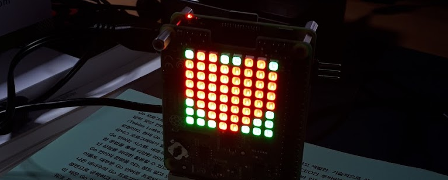

# Matrix4



A toy project to drive Sense Hat's LED matrix by using Gotk3 based application

<br/><br/>

## 1. Prerequsites

- Some familiarity regarding Raspberry Pi OS and terminal interface.
- Raspberry Pi 4B and Sense Hat
- Boot parameter: RPI4 and Sense Hat have some issues and it blocks the boot process. To avoid the issues, configure as below when Sense Hat is not installed:
     - For Raspberry Pi OS, add **hdmi_force_hotplug=1** to /boot/config.txt
     - For Ubuntu, add **hdmi_force_hotplug=1** to /boot/firmware/config.txt
- Go SDK installed in Pi (newer than v1.13)

<br/><br/>

## 2. Preparation and installation

<br/>

### 2.1 i2c activation

Enable i2c communication by using raspi-config.

```sh
$ sudo raspi-config
# Interface options => I2C => Enable

# To confirm:
# The entry 0x46 should have some value, which indicate existence of AATINY MCU
# https://pinout.xyz/pinout/sense_hat
$ sudo apt install i2c-tools
$ sudo i2cdetect -y 1 
```

<br/>

### 2.2 Build

Clone and build:
```sh
$ sudo apt install -y libgtk-3-dev libglib2.0-dev libgdk-pixbuf2.0-dev
$ git clone https://github.com/bus710/matrix4.git

# Build - takes some time
$ cd matrixd/src
$ make build

# Run
$ make run
```

<br/><br/>

## 3. Usage

The UI looks like the image below and the components have features like these:
- Each box represents each LED on Sense Hat (each box can be pressed to be chosen).
- The RGB sliders change the color of boxes selected.
- All and None buttons pick all or none of the boxes.
- The **random** button sends a random configuration to the backend. 
- The **submit** button sends the current configuration to the backend. 

<br/>


<br/><br/>

## 4. Conclusion

With this simple project, the LEDs on Sense Hat can be easily controlled by the Gotk3 based application but no complex SDKs are required. However, anyone interests of using Go, Gotk3 or the i2c of RPI may check the source code in this repository to add more features. 

<br/><br/>

----

**Disclaimer**

```
This is just a toy project that cannot be used for safety/commercial tasks.   
The developer doesn't take any kind of (phsical, mental, and financial) responsibility. 
```
